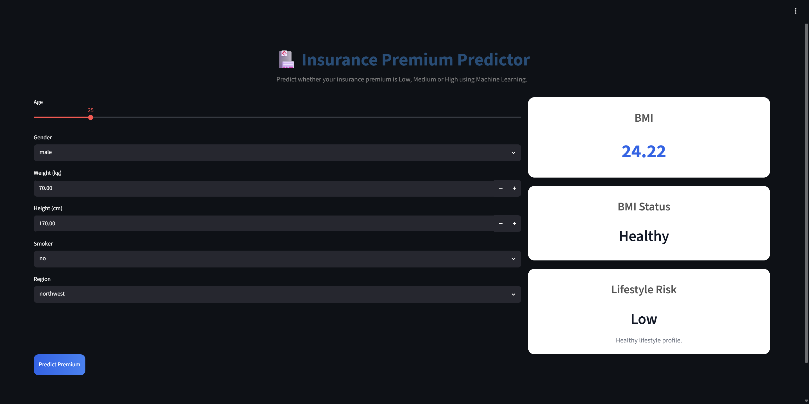
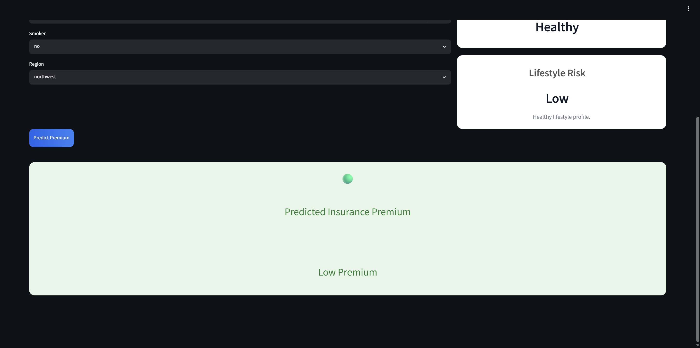

# 🏥 Insurance Premium Predictor

<p align="center">


</p>

---

## 📌 Project Overview

An end-to-end **Machine Learning Web Application** that predicts whether an individual's insurance premium falls into the **Low**, **Medium**, or **High** category based on personal and lifestyle information.

The application is built using:

- 🧠 Machine Learning (Random Forest Classifier)
- ⚡ FastAPI REST API
- 🎨 Streamlit Frontend
- 🐳 Docker
- ☁️ Render Deployment

---

# 🌐 Live Demo

### 🎨 Frontend

https://insurance-premium-prediction-8sca.onrender.com

### ⚡ Backend API

https://insurance-premium-api-8l5n.onrender.com/docs

---

# 📸 Application Preview

## Home Page



---

## Prediction Result



---

# ✨ Features

✅ Predict Insurance Premium Category

✅ Real-time API Integration

✅ BMI Calculator

✅ BMI Status Indicator

✅ Lifestyle Risk Analysis

✅ Responsive Streamlit Dashboard

✅ Dockerized Backend

✅ REST API using FastAPI

✅ Interactive Swagger Documentation

---

# 🏗️ Architecture

```
                 User
                   │
                   ▼
        Streamlit Frontend
                   │
         HTTP Request (POST)
                   │
                   ▼
          FastAPI Backend
                   │
                   ▼
      Random Forest Classifier
                   │
                   ▼
      Insurance Premium Prediction
```

---

# 📂 Project Structure

```
Insurance-premium-prediction/

│
├── frontend/
│   └── app.py
│
├── models/
│   └── insurance_classifier.pkl
│
├── schema/
│   └── user_input.py
│
├── src/
│   ├── main.py
│   ├── predict.py
│   └── train.py
│
├── Dockerfile
├── requirements.txt
├── .dockerignore
├── .gitignore
└── README.md
```

---

# 🤖 Machine Learning Model

Model Used:

- Random Forest Classifier

Target Classes:

- 🟢 Low Premium
- 🟡 Medium Premium
- 🔴 High Premium

Input Features:

- Age
- Gender
- Height
- Weight
- Smoker Status
- Region

Additional Calculations:

- BMI
- BMI Category
- Lifestyle Risk

---

# ⚙️ Tech Stack

| Technology | Purpose |
|------------|---------|
| Python | Programming Language |
| Scikit-Learn | Machine Learning |
| Pandas | Data Processing |
| NumPy | Numerical Computing |
| FastAPI | Backend API |
| Streamlit | Frontend |
| Docker | Containerization |
| Render | Deployment |
| Git | Version Control |
| GitHub | Repository Hosting |

---

# 🚀 Running Locally

## Clone Repository

```bash
git clone https://github.com/Sanjay-jat/Insurance-premium-prediction.git

cd Insurance-premium-prediction
```

---

## Install Dependencies

```bash
pip install -r requirements.txt
```

---

## Run FastAPI

```bash
uvicorn src.main:app --reload
```

Backend:

```
http://127.0.0.1:8000
```

Swagger Docs:

```
http://127.0.0.1:8000/docs
```

---

## Run Streamlit

```bash
cd frontend

streamlit run app.py
```

---

# 🐳 Docker

Build Docker Image

```bash
docker build -t insurance-api .
```

Run Container

```bash
docker run -p 8000:8000 insurance-api
```

---

# 📡 API Endpoint

## POST

```
/predict
```

Example Request

```json
{
  "age": 25,
  "gender": "male",
  "weight": 70,
  "height": 170,
  "smoker": "no",
  "region": "northwest"
}
```

Example Response

```json
{
  "prediction": "Low Premium"
}
```

```
# 👨‍💻 Author

**Sanjay Jat**

B.Tech Computer Science Engineering

Machine Learning Enthusiast

GitHub:

https://github.com/Sanjay-jat

LinkedIn:

https://www.linkedin.com/in/sanjay-jat
```
---

# ⭐ If you like this project

Give this repository a ⭐ on GitHub!

It motivates me to build more Machine Learning projects.
